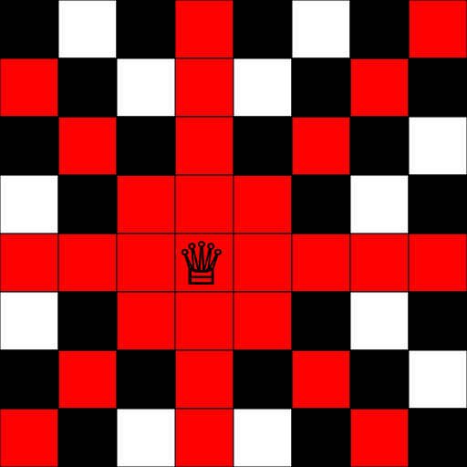
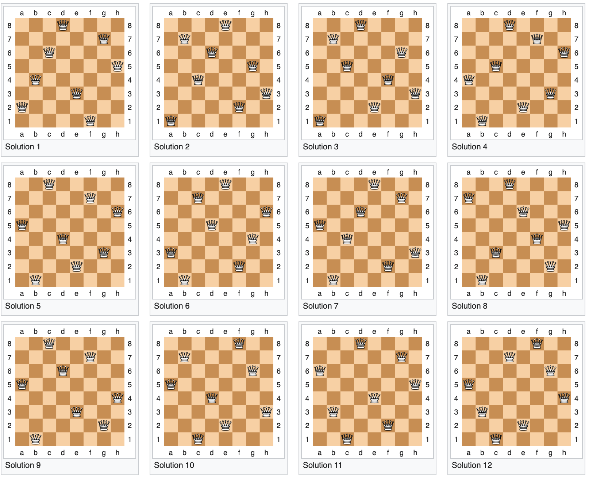

# Genetic Algorithm - Eight Queens Puzzle
>Course project of **`COMPUTATIONAL INTELLIGENCE FOR OPTIMIZATION`**  course - [MDSAA-DS](www.novaims.unl.pt/MDSAA-DS) - Spring 2023

## Eight Queens Puzzle
The `eight queens` puzzle is a classic puzzle in chess, going back to 1848. The goal is to try to place eight queens on a chessboard so that none of them are attacking any of the other.
More information about the puzzle can be found on [Wikipedia](https://en.wikipedia.org/wiki/Eight_queens_puzzle). 
Or you can watch [this video](https://youtu.be/jPcBU0Z2Hj8) to get a better understanding of the problem.

## Table of Contents
- [Computational Complexity Analysis](#computational-complexity-analysis)
  - [Problem Statement](#problem-statement)
  - [Solutions](#solutions)
  - [Challenge](#challenge)
  - [Possible Optimization](#possible-optimization)
- [Project Overview](#project-overview)
  - [Genetic Algorithm](#genetic-algorithms)

- [Up And Running](#up-and-running)
  - [Docker](#docker) 
  - [Run application](#run-application)
  - [Remove application](#remove-application)
- [SetUp](#setup)
  - [Project GUI](#project-gui)
  - @TODO
- [Modules](#modules)
  - [Fitness Module](#fitness-module)
  - [Crossover Module](#crossover-module)
  - [Mutation Module](#mutation-module)
  - [Algorithm](#algorithm)
- [Usage](#usage)
  - [Run the Algorithm](#run-the-algorithm)

## Computational Complexity Analysis

So before we dive into the Genetic Algorithms, let's first understand and represented the problem mathematically to get a better understanding of problem computational complexity.

### Problem Statement

The `eight queens` puzzle is a classic puzzle in chess, going back to 1848. The goal is to try to place eight queens on a chessboard so that none of them are attacking any of the other.

*Ps. The queen can move as far as she likes vertically, horizontally or diagonally. which mean we can't place two queens in the same row, column, or diagonal.* S*o on a normal chessboard (8 x 8) we can't put nine or more queens. Eight is the maximum.*

*A single queen threatening the squares on the board (marked in red)*

Our task here is to find all such configurations of queens on the *(8 x 8)* board. There are 92 possible configurations.

### Solutions

There are 92 solutions to the *8 x 8* problem. Many of these are reflections and rotations of some of the others, and if we de-duplicate against this, purists state that there are only 12 distinct solutions (92 does not divide equally by 12 because many of the reflections and rotations of a pure solutions are not unique).

All fundamental solutions are presented below:

### Challenge

[Brute-force computational techniques](https://en.wikipedia.org/wiki/Brute-force_search)  could be the first possible mechanism we think of where blindly trying the eight queens in every possible location. This is a really dumb idea and computationally so expensive, but would calculate all possible combinations Using [Combinations Calculator nCr](https://www.calculatorsoup.com/calculators/discretemathematics/combinations.php) :

$$ C(n, r) = ({n \over r}) = {n! \over (r!(n-r)!)} $$

$$ C(64, 8) = {64! \over (8!(64 - 8)!)} = 4,426,165,368 $$

Imagine having to test 4,426,165,368 combinations. If we can process 50,000 combinations per second that's going to take our computer over 24 hours to complete the task. ouch!

### Possible Optimization

- By applying a simple rule that to put each queen on a separate row, and this massively reduces the number of possibilities.

$$ P(n,n) = n^n $$

$$ P(8,8) = 8^8 = 16,777,216 $$

- Similarly, there can be only one queen per column, and this reduces the possibilities even further. The problem can be trimmed down to an analogous problem of generating [permutations](https://en.wikipedia.org/wiki/Permutation) of the 8 queens, which can then be checked for diagonal attacks.
The number of possible permutations would be 
$$ n! = 8! = 40,320 $$
This is a much more manageable number. However, checking each permutation is still computationally expensive.

## Project Overview

### Genetic Algorithms
Genetic algorithms are a powerful technique for optimization problems that mimic natural selection. 

In this project, we're going to use genetic algorithms to solve the classic 8 Queen Puzzle. The goal is to find a placement of 8 queens on a chessboard such that no two queens are attacking each other. We start with an initial state where some queens may be attacking each other, and use the genetic algorithm to evolve towards the optimal solution. The project includes a Python implementation of the genetic algorithm, as well as visualization tools to help understand the evolution process. Our results show that the genetic algorithm can efficiently solve the 8 Queen Puzzle and find solutions that are optimal or close to optimal.

## Up And Running

### Docker

This application is shipped with the Docker Compose environment and requires Docker to be installed locally and running.
If you're not familiar with Docker or don't have it locally, please reach out to 
[the official website](https://www.docker.com)
 to learn more and follow the Docker installation instructions to install it on your platform:   

[Docker for Mac](https://docs.docker.com/desktop/install/mac-install/)  
[Docker for Linux](https://docs.docker.com/desktop/get-started/)  
[Docker for Windows](https://docs.docker.com/desktop/install/windows-install/)

The Project is containerized within one container currently on `Python-3.11-slim` image. 
You don't need to build anything locally, the related images will be automatically pulled from the remote registry 
as soon as you run the application for the first time.

Dependencies:
* `fastapi` - for building APIs with Python.
* `requests` - for making HTTP requests and handling responses.
* `uvicorn` - for running Python APIs.
* `debugpy` - for debugging of Python code running in a container.

### Run application

Once you have Docker up and running please perform the following command to start the application:

    docker-compose up

Alternatively you can start the application containers in detached mode to suppress containers messages:

    docker-compose up --detach

Please see the `Logs` for more details about log messages:

    docker-compose logs -f

If you run the application for the first time, this will pull images from the remote repository, 
create `ga-8queens-puzzle` container run the `pip install` command.

The container will be listening on port `80` on your `localhost`, you can access the application main page using the 
following URL: [http://localhost](http://localhost:80).

### Remove application

As soon as you are done with the test assignment you can stop the application:

    docker-compose down

This will stop the application and remove containers & network.

## SetUp

### Project GUI
@TODO

## Modules

### Fitness Module
@TODO

### Crossover Module
@TODO

### Mutation Module
@TODO

### Algorithm
@TODO

## Usage

### Run the Algorithm
@TODO
